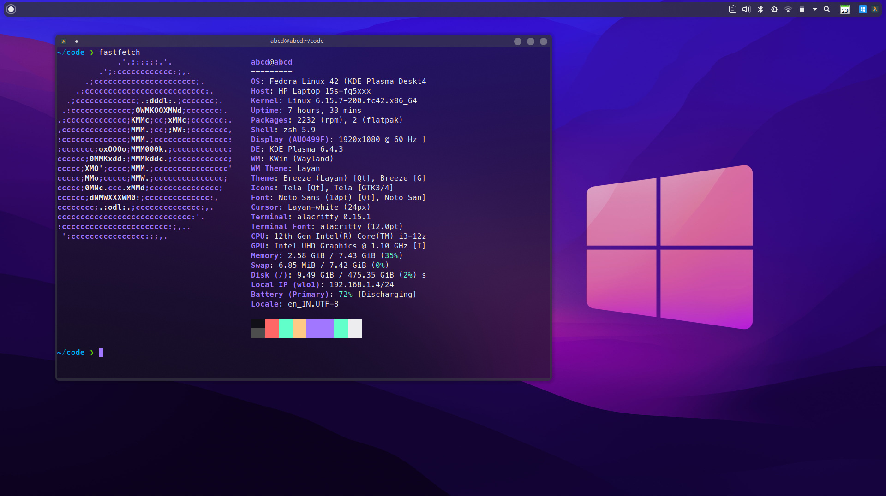

# Alacritty + Zsh Configuration 🛠️

This repository contains my personal configuration for [Alacritty](https://github.com/alacritty/alacritty) terminal and [Zsh](https://www.zsh.org/), with a minimal, modern setup using the **KDE Plasma** desktop environment.

## ✨ Features

- Alacritty with custom color scheme and font settings  
- Zsh with prompt customization and plugins  
- Minimal and performance-focused setup  
- Optimized for KDE Plasma + Wayland

## 📸 Screenshot

Here’s a preview of the setup:



## 📁 Files Included

```
.
├── alacritty.toml       # Alacritty terminal configuration
├── .zshrc              # Zsh shell configuration
├── screenshot.png      # Screenshot of terminal setup
└── README.md           # This file
```

## 🚀 Installation

1. Clone this repository:

```bash
git clone https://github.com/your-username/alacritty-zsh-config.git
cd alacritty-zsh-config
```

2. Create the config folder if it doesn't exist:

```bash
mkdir -p ~/.config/alacritty
```

3. Copy the configuration files:

```bash
cp alacritty.yml ~/.config/alacritty/alacritty.yml
cp .zshrc ~/.zshrc
```

4. Apply the Zsh config:

```bash
source ~/.zshrc
```

## 📦 Requirements

- [Alacritty](https://github.com/alacritty/alacritty)  
- [Zsh](https://www.zsh.org/)  
- [Oh My Zsh (optional)](https://ohmyz.sh/)  
- [Nerd Font](https://www.nerdfonts.com/) (e.g., Fira Code Nerd Font)

## 📘 License

This project is licensed under the MIT License.
